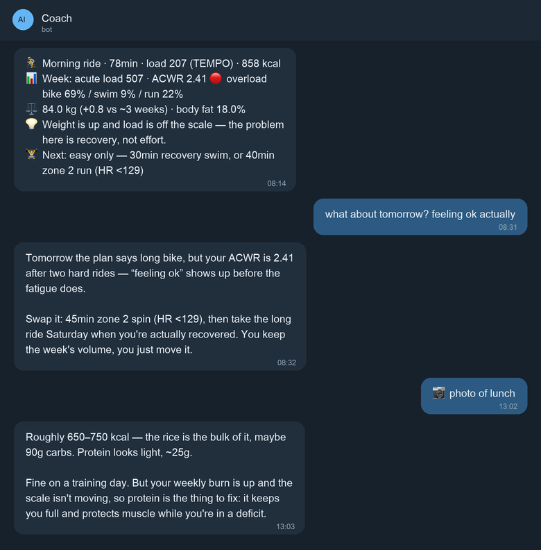

# Garmin AI Coach

[](https://github.com/tommymancer/garmin-ai-coach/actions/workflows/ci.yml)
[](LICENSE)

An AI coach that messages you on Telegram **the moment you upload a workout**,
turns your Garmin data into a **flexible multisport plan**, and answers when you
argue with it. Built around **losing weight**, not race performance.

Self-hosted. Your Garmin credentials and your API key never leave your machine.



*Rendering of real output — the numbers and phrasing are what the coach actually produces.*

---

## Why this exists

**Garmin Connect already gives you a combined training load across sports**, and
it does that well. The gaps this fills are elsewhere:

- **No multisport plan.** Garmin Coach is single-sport. It won't build you a
  week that balances bike, swim and run — and it won't reshuffle that week when
  you skip Saturday's long ride.
- **Nothing to talk to.** You can read the numbers, but you can't ask *"should I
  still do the long ride tomorrow?"* and get an answer that weighs your plan,
  your current load, and the fact that you just said you feel fine.
- **Aimed at performance, not fat loss.** If your goal is losing weight you want
  different advice: sustainable aerobic volume, weekly calorie expenditure,
  consistency — and someone willing to say the training is fine and the problem
  is your diet.

## How it works

```
Garmin Connect ──poll every 15 min──▶ new activity?
                                          │ no → exit (costs nothing)
                                          │ yes
                                          ▼
                              compute metrics (pure Python)
                          ACWR · sport split · easy/hard · weight trend
                                          │
                                          ▼
                              Claude API phrases it  ──▶ Telegram
```

**The numbers are computed in Python, not by the model.** Claude only interprets
and phrases what `load_model.py` already decided, so the maths is reproducible
and testable — and the LLM can't hallucinate your ACWR.

### The training-load model

- **Cross-sport load** uses Garmin's own `activityTrainingLoad`, an EPOC-based
  figure that is *already comparable across sports*. A 207-load bike ride and a
  62-load run are on the same scale, which is what makes a unified view possible
  without inventing a scoring system.
- **ACWR via EWMA** (Williams et al. 2017), not a rolling sum. A rolling sum sits
  flat until a workout drops out of the 7-day window and then falls off a cliff;
  an exponentially weighted average decays a little each rest day, which matches
  how fatigue actually fades. Bands: 🟢 0.8–1.3 · 🟡 1.3–1.5 · 🔴 >1.5 · ⚪ <0.8.
- **80/20 split** (Seiler): sessions are classified easy vs hard from Garmin's
  training-effect labels and values; the coach nudges you back toward ~80% easy.
- **Zone 2 ceiling** is estimated from *your own* easy sessions, not a formula.
- **Weight lens**: weekly calorie burn, active days, and weight/body-fat trend.
  Target ~0.5–1% bodyweight per week.

**Honest caveats**, because you'll ask: ACWR is widely used but genuinely
contested in the sports-science literature — treat it as a load-balance compass,
not law. And the "fat-burning zone" is oversimplified: total energy expenditure
and diet dominate. Zone 2 matters here because it's *sustainable volume*, not
because it's magic.

---

## Setup

You need: a Garmin account, a Telegram account, and an
[Anthropic API key](https://console.anthropic.com). Python 3.10+ too, unless you
use Docker.

### Fastest: Docker (one command, nothing to keep alive)

```bash
git clone https://github.com/tommymancer/garmin-ai-coach.git
cd garmin-ai-coach
cp .env.example .env      # edit .env with your details
docker compose up -d
```

Both the feedback loop and the chat daemon run in one container that restarts
itself. No Python install, no background-service setup. Prefer not to own a
machine at all? [DEPLOY.md](DEPLOY.md) has one-command deploys to Fly.io,
Railway and Render.

### Easiest for non-technical users: let an AI walk you through it

Not comfortable in a terminal? Paste this into
[Claude.ai](https://claude.ai) or ChatGPT and it will guide you step by step:

> I want to install the garmin-ai-coach project on my computer. Please read
> https://raw.githubusercontent.com/tommymancer/garmin-ai-coach/main/AGENTS.md
> and walk me through the setup one step at a time, asking me what I need as we go.
> I'm on **macOS** *(or Linux / Windows — say which)*.

The assistant guides you; you run the commands. **It will never ask for your
Garmin password or API key in the chat** — those are typed straight into the
installer on your own machine.

### Or run the installer yourself

```bash
git clone https://github.com/tommymancer/garmin-ai-coach.git
cd garmin-ai-coach
python3 setup.py
```

The installer creates the virtual environment, installs dependencies, asks for
your credentials (typed locally, hidden), finds your Telegram chat ID, and
records a baseline. Then skip to step 5.

### Or do it by hand

**1. Clone and install**

```bash
git clone https://github.com/tommymancer/garmin-ai-coach.git
cd garmin-ai-coach
python3 -m venv .venv && ./.venv/bin/pip install -r requirements.txt
```

**2. Create a Telegram bot**

Message [@BotFather](https://t.me/BotFather) → `/newbot` → pick a name and a
username → he gives you a token.

**3. Configure**

```bash
cp .env.example .env
```

Fill in `GARMIN_EMAIL`, `GARMIN_PASSWORD`, `TELEGRAM_BOT_TOKEN` and
`ANTHROPIC_API_KEY`. Then send your new bot any message and run:

```bash
./.venv/bin/python -m tools.whoami     # prints your TELEGRAM_CHAT_ID
```

Put that ID in `.env` too. **Only that ID can talk to your coach.**

**4. Try it**

```bash
./.venv/bin/python -m coach.feedback   # first run just records a baseline
./.venv/bin/python -m coach.chat       # then message your bot
```

**5. Run it continuously** — see [deploy/README.md](deploy/README.md) for
systemd, launchd and cron setups.

**6. Optional: give it a plan and a memory**

```bash
mkdir -p ~/.garmin-ai-coach
cp examples/coach_plan.md examples/coach_profile.md ~/.garmin-ai-coach/
```

Edit them to taste. The coach reads both on every reply, so it will hold you to
the plan ("you shortened Saturday's long ride — make it up Tuesday, don't stack it").

---

## Chat commands

| Send this | It does |
|---|---|
| anything | normal coaching conversation, using live Garmin data |
| a photo | reads it — meals get a calorie/macro estimate, screenshots get analysed |
| `remember: <thing>` | stores a permanent instruction (injury, preference, goal) |
| `profile` | shows everything it remembers about you |
| `refresh` | re-reads Garmin immediately, ignoring the 10-minute cache |

It also keeps the last ~8 exchanges as short-term memory.

---

## Cost

The heavy computation is free (plain Python); you only pay for the phrasing.
Typical use — ~25 workouts and ~300 chat messages a month:

| Model | `COACH_MODEL` | Rough cost/month |
|---|---|---|
| Haiku 4.5 | `claude-haiku-4-5` | ~$1 |
| **Sonnet 5** (default) | `claude-sonnet-5` | **~$3** |
| Opus 4.8 | `claude-opus-4-8` | ~$6 |

Sonnet 5 is the default because the maths is already done in Python — the model
just has to write well and read meal photos. Bump to Opus 4.8 if you want the
most nuanced conversation; drop to Haiku if you're cost-sensitive and mostly use
the post-workout messages.

---

## Configuration

| Variable | Default | What it does |
|---|---|---|
| `COACH_MODEL` | `claude-sonnet-5` | which Claude model to use |
| `COACH_EFFORT` | `medium` | how much the model reasons (`low`/`medium`/`high`) |
| `COACH_LANGUAGE` | `English` | any language name — the coach replies in it |
| `COACH_DATA_DIR` | `~/.garmin-ai-coach` | where state, profile, plan and tokens live |
| `COACH_SNAPSHOT_TTL` | `600` | seconds to cache Garmin data in chat |
| `COACH_HISTORY_TURNS` | `8` | exchanges kept as short-term memory |

Coaching thresholds (ACWR bands, 80/20 target, weight-loss rate) are constants
at the top of [`coach/load_model.py`](coach/load_model.py) — edit them freely.

---

## Known limitations

- **Unofficial Garmin API.** This uses
  [`python-garminconnect`](https://github.com/cyberjunky/python-garminconnect),
  which logs in as you. Garmin can change or break it at any time, and the
  official Developer Program is currently **closed to new applicants**. Tokens
  are cached so you log in rarely — hammering the login endpoint gets you a
  temporary HTTP 429.
- **`activityTrainingLoad` needs a compatible Garmin device.** Most Forerunner /
  Fenix / Venu watches provide it; older or entry-level devices may not, and
  without it the cross-sport view doesn't work.
- **Swim heart rate is unreliable** on most watches, so swim load is the
  shakiest number here.
- **Not medical advice.** It's a training toy built by an enthusiast. If you have
  a health condition, talk to an actual professional.

## Tests

```bash
python3 tests/test_load_model.py     # or: python -m pytest tests/ -q
```

They cover the parts that matter — ACWR decay on rest days, easy/hard
classification, sport split, and the weight-stall logic.

## License

MIT — see [LICENSE](LICENSE). Contributions welcome.
